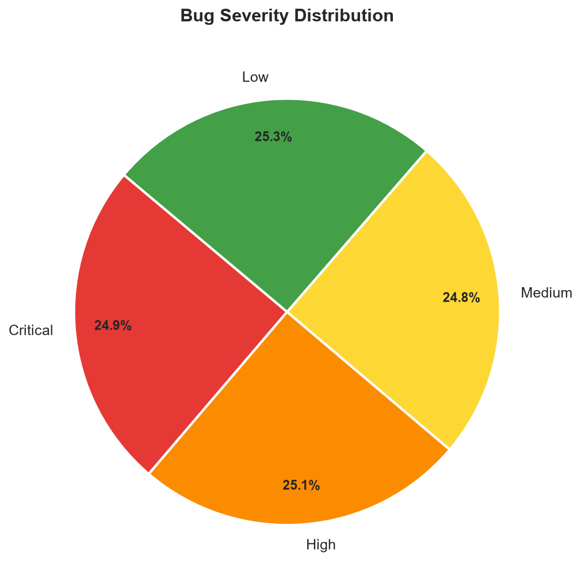
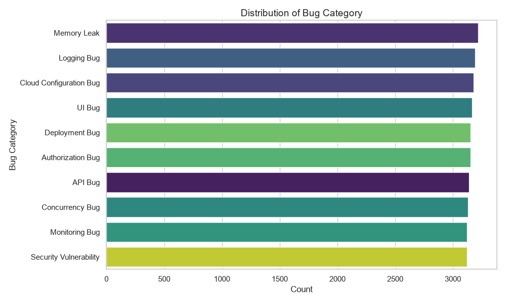
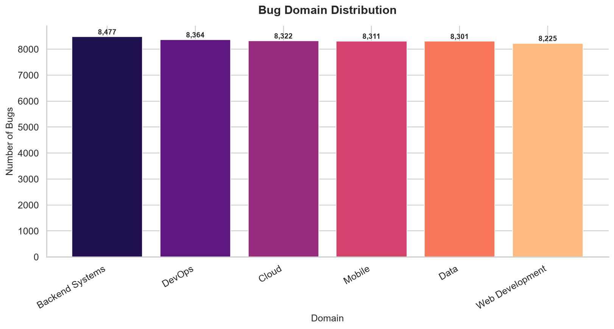
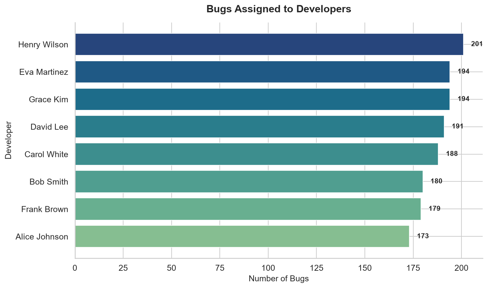
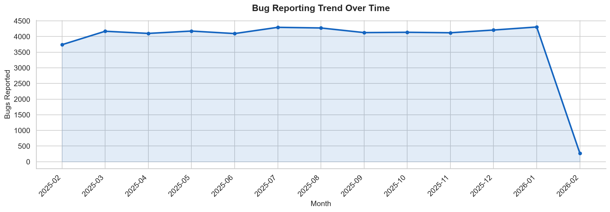
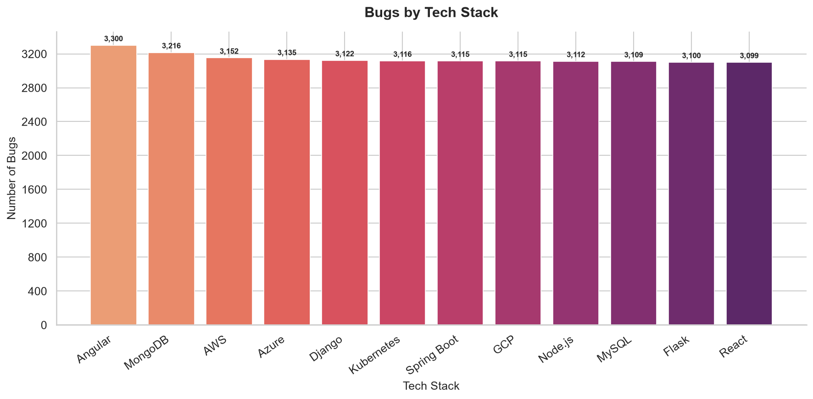
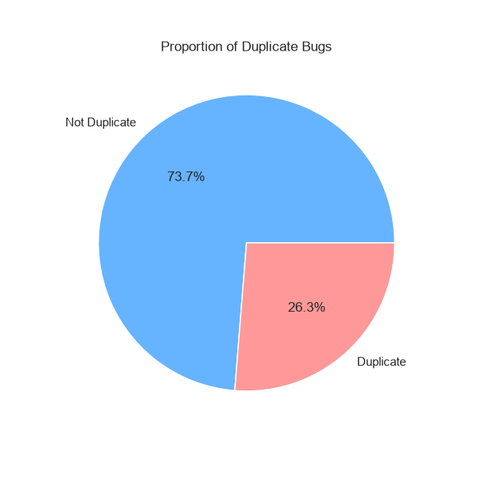

# Bug Management System — Project Report

An end-to-end machine learning pipeline that collects, cleans, visualizes, and models a real-world bug report dataset, covering data preprocessing, exploratory visualization, duplicate detection, severity prediction, and a documented account of the data-quality issues discovered while building it.

---

## 1. Overview

| | |
|---|---|
| **Project** | Bug Management System |
| **Pipeline** | 7 stages, `src/01_data_collection.py` → `src/06_predict.py` |
| **Dataset size** | 50,000 bug reports |
| **Core task** | Predict bug **severity** (Low / Medium / High / Critical) from structured and text fields |
| **Stack** | Python 3.11, Pandas, NumPy, scikit-learn, Matplotlib, Seaborn, joblib |

The pipeline runs as six ordered scripts, each consuming the previous stage's output:

```
01_data_collection.py   → loads & summarizes the raw dataset
02_preprocessing.py     → cleans, encodes → bug_reports_processed.csv
03_visualization.py     → 6 charts + console observations
04_duplicate_detection.py → TF-IDF similarity → potential_duplicates.json
05_modeling.py          → trains/evaluates 5 ML models → models/*.pkl
06_predict.py           → predicts severity for a new bug description
```

---

## 2. Dataset

**Source:** Kaggle — *"50k Bug Dataset"* (`data/bug_dataset_50k.csv`). Not bundled in the repo (exceeds GitHub's file-size limits); downloaded manually and placed in `data/` before running the pipeline.

**Shape:** 50,000 rows × 14 columns.

| Field | Description |
|---|---|
| `bug_id` | Unique identifier (`BUG_000001` … `BUG_050000`) |
| `title` | Short title of the bug |
| `description` | Descriptive text of the bug |
| `error_code` | HTTP-style error code (400 / 401 / 403 / 404 / 500 / 502 / 503) |
| `bug_category` | Type of bug (16 categories — Memory Leak, API Bug, Auth Bug, etc.) |
| `bug_domain` | System domain (Backend, Mobile, DevOps, Cloud, Data, Web) |
| `tech_stack` | Technology involved (Angular, Flask, Django, MongoDB, etc.) |
| `severity` | Low / Medium / High / Critical |
| `environment` | Development / Staging / Production |
| `developer_role` | Role responsible (Backend Developer, DevOps Engineer, etc.) |
| `root_cause` | Stated cause of the bug |
| `suggested_fix` | Suggested remediation |
| `explanation` | One-line note on which role/skillset the bug requires |
| `created_at` | Date the bug was reported |

There is **no `priority` field in this dataset** — see §7.

---

## 3. Data Preprocessing (`02_preprocessing.py`)

Run against the raw 50k CSV, this stage performs and reports on four things:

1. **Null-value analysis.** Only `error_code` has nulls (6,188 rows, ~12.4%) — left as-is since it isn't used downstream. Text columns (`title`, `description`, `root_cause`, `suggested_fix`, `explanation`) are filled with an empty string if null; rows missing `severity` or `bug_category` (the critical columns) are dropped. On this dataset, **0 rows** were dropped — all records already have both fields populated.
2. **Duplicate analysis.** Checks for fully duplicate rows and duplicate `bug_id` values. On this dataset: **0 fully duplicate rows, 0 duplicate `bug_id` values** — the 50k records are already unique by ID.
3. **Anomaly/outlier analysis.** Checks for empty descriptions/titles, unexpected `severity` values outside `{Low, Medium, High, Critical}`, and IQR-based outliers on `error_code`. On this dataset: **no anomalies found** — all severity values are valid and no outliers were flagged.
4. **Label encoding.** `severity`, `bug_category`, `bug_domain`, `tech_stack`, `environment`, and `developer_role` are each label-encoded into a companion `<col>_encoded` column, and the fitted encoders are saved to `models/label_encoders.pkl` for later use by prediction.

**Output:** `data/bug_reports_processed.csv` (50,000 rows, original + `*_encoded` columns).

> **Note on "cleaning":** the dataset arrives already structurally clean (no nulls in key fields, no duplicate IDs, no malformed categories). The real data-quality issue in this project isn't dirty rows — it's the *content* of the text fields, covered in §8.

---

## 4. Data Visualization (`03_visualization.py`)

Six charts are generated from the processed dataset into `visualizations/`. All figures below are the actual verified counts from `bug_reports_processed.csv`. Each chart is saved at 150 DPI and the script also prints a console "Observations" summary derived from the same computed counts (top/bottom category per chart).

### Bug Severity Distribution


Pie chart of the 4 severity levels. Nearly even split: Low 12,628 (25.3%), High 12,535 (25.1%), Critical 12,432 (24.9%), Medium 12,405 (24.8%).

### Bug Category Distribution


Bar chart of the top 10 (of 16) `bug_category` values by count. Memory Leak is highest (3,220); Frontend Routing Bug is lowest of the full set (2,985).

### Bug Domain Distribution


Bar chart across the 6 `bug_domain` values. Backend Systems leads (8,477), Web Development is lowest (8,225) — all six domains are within ~3% of each other.

### Bugs Assigned by Developer Role


Horizontal bar chart across the 9 `developer_role` values. Mobile Developer carries the most (5,701), Frontend Developer the fewest (5,451).

### Bug Reporting Trend Over Time


Monthly line chart from `created_at`. Peaks in **January 2026** (4,304 bugs); February 2026 is a partial month (only 270 bugs — the dataset's date range simply ends there, not a real drop-off).

### Bugs by Tech Stack


Bar chart of the top 12 (of 16) `tech_stack` values. Angular leads (3,300), Vue is lowest of the full set (3,050).

---

## 5. Duplicate Bug Detection (`04_duplicate_detection.py`)

**Method:** TF-IDF vectorizes the `description` column (500 max features, English stop-words removed), then computes pairwise cosine similarity. Any pair scoring above **0.85** is flagged as a potential duplicate. Because a full 50,000×50,000 similarity matrix is expensive, a **random sample of 5,000 rows** (fixed seed 42) is used.

**Result on this dataset:** 780,515 pairs flagged above threshold, saved to `data/potential_duplicates.json`, plus a bar chart of duplicate vs. unique counts within the sample:



**Important caveat** — see §8 for the full explanation: this dataset's `description` field is a fixed boilerplate template per `bug_category` (only 16 distinct strings across all 50,000 rows). Every bug in the same category has an *identical* description, so cosine similarity between any two same-category bugs is exactly 1.0. In practice, this method is detecting **"same category"**, not genuine duplicate bug reports — the 780,515 figure should not be read as real duplication.

---

## 6. Machine Learning Models (`05_modeling.py`)

**Feature extraction:** TF-IDF on `description` — 2,000 max features, unigrams + bigrams, English stop-words removed. Fitted vectorizer saved to `models/tfidf_vectorizer.pkl`. Training is capped at a random 20,000-row sample (seed 42) for runtime.

**Models trained** (all 5, on the same TF-IDF features, 80/20 train/test split, stratified by target):

| Model | Notes |
|---|---|
| Naïve Bayes | `MultinomialNB` — fast probabilistic baseline |
| Logistic Regression | Linear classifier, `max_iter=1000` |
| Decision Tree | `DecisionTreeClassifier` |
| Random Forest | `RandomForestClassifier`, 100 trees |
| SVM (Linear) | `LinearSVC` wrapped in `CalibratedClassifierCV` for probability support |

**Targets:** `severity` and `bug_category` (this dataset has no `priority` column — see §7).

**Metrics:** Accuracy, Precision, Recall, F1-score (weighted), from `data/model_evaluation_results.json`:

| Model | Severity Accuracy | Severity F1 | Bug Category Accuracy | Bug Category F1 |
|---|---|---|---|---|
| Naïve Bayes | 0.2555 | 0.2487 | 1.0000 | 1.0000 |
| Logistic Regression | 0.2560 | 0.2464 | 1.0000 | 1.0000 |
| Decision Tree | 0.2592 | 0.2470 | 1.0000 | 1.0000 |
| Random Forest | 0.2560 | 0.2461 | 1.0000 | 1.0000 |
| SVM (Linear) | 0.2602 | 0.2147 | 1.0000 | 1.0000 |

The best model per target (by F1) is saved to `models/best_severity_model.pkl` and `models/best_bug_category_model.pkl`. Read these two columns against §8 before treating either as a working classifier — neither result means what it looks like at a glance.

---

## 7. Severity & Priority Prediction (`06_predict.py`)

**Only severity is predicted.** This dataset has no `priority` field at all, so priority prediction isn't part of this pipeline — an earlier version of this project had aliased the severity model under a `best_priority_model.pkl` filename as a leftover from a prior dataset schema; that dead alias has been removed, and `06_predict.py` only ever loads `best_severity_model.pkl`.

**How it works:** takes a `--desc` string, vectorizes it with the saved TF-IDF vectorizer, runs it through the saved severity model, and inverse-transforms the predicted class back to its label (`Low` / `Medium` / `High` / `Critical`) via the saved label encoder. A one-line human-readable note is attached per severity level.

### Final Bug Report — Worked Example

```
$ python src/06_predict.py --desc "Users report the checkout page freezes and the app
  crashes intermittently after submitting payment on the production server."

============================================================
  TASK 7: Bug Severity Prediction
============================================================

  Input Description:
  Users report the checkout page freezes and the app crashes intermittently
  after submitting payment on the production server.

  --------------------------------------------------------
  Predicted Severity : Low
  Note               : Minor impact -- address when possible.
  --------------------------------------------------------
============================================================
```

Note the mismatch: a description describing app crashes and payment failures in production is predicted **"Low"**. This isn't a code defect — it's the direct, visible consequence of §8's finding: `severity` carries no learnable signal anywhere in this dataset, so the model's output is effectively arbitrary regardless of how severe the input text sounds.

---

## 8. Data Quality Findings

These are properties of the source dataset itself, discovered while validating the pipeline — not bugs in this repo's code.

1. **`title`, `description`, `root_cause`, and `suggested_fix` are boilerplate templates, not free text.** Each has only **16 unique values across all 50,000 rows** — one fixed template per `bug_category` (e.g. every "Memory Leak" row shares the exact same description string, verbatim: *"This issue relates to a memory leak occurring in the application."*). `explanation` has only 9 unique values. None of these fields carry per-bug information beyond the category name.

2. **Consequence for Bug Category prediction:** all 5 models score **100.0% accuracy** (§6). This is not generalization — it's leakage. The model is matching a template string back to the exact label it was copied from.

3. **Consequence for Severity prediction:** all 5 models score **~25.5% accuracy** (§6) — chance level for 4 balanced classes. Cross-tabulating `severity` against `bug_category`, `bug_domain`, `environment`, `error_code`, and `developer_role` shows a near-uniform ~25% split within every group — severity appears to be assigned independently at random in the source data. **No model, text-based or feature-based, can predict it above chance from this dataset.**

4. **Consequence for duplicate detection (§5):** because every bug in a category shares identical description text, TF-IDF cosine similarity flags same-category bugs as "duplicates" (similarity = 1.0) regardless of whether they represent the same reported issue. The 780,515-pair figure reflects **category membership, not genuine duplication.**

5. **Cleanup performed:** a leftover `data/bug_reports.csv` (1,500-row artifact from an earlier synthetic-data version of this project) and a dead `models/best_priority_model.pkl` alias have been removed, along with stale README/`.gitignore` references to both.

6. **Not yet cleaned up (flagged, not actioned):** `visualizations/` contains 8 extra PNGs (`bug_status.png`, `bug_priority_distribution.png`, `bug_status_distribution.png`, `developer_role_distribution.png`, `environment_distribution.png`, `priority_distribution.png`, `severity_distribution.png`, `tech_stack_distribution.png`) that are not produced by any current script — leftovers from an earlier pipeline version that had `status`/`priority` fields. They're likely safe to delete but were left in place pending confirmation.

---

## 9. Conclusion

The pipeline runs cleanly end-to-end on the real 50k Kaggle dataset: preprocessing finds a structurally clean dataset (no nulls in key fields, no duplicate IDs, no invalid categories), six charts summarize its categorical and time-based structure accurately, and five ML models train and evaluate without error.

The one substantive limitation is in the dataset's text content, not the code: `description` and related text fields are per-category boilerplate rather than genuine free text, which makes Bug Category prediction trivial (leakage) and Severity prediction impossible to do better than chance from this data — regardless of which of the five models or which features are used. This has been documented in the README and directly in the console output of `04_duplicate_detection.py` and `05_modeling.py`, so future runs surface the caveat rather than presenting inflated or misleading metrics at face value.
