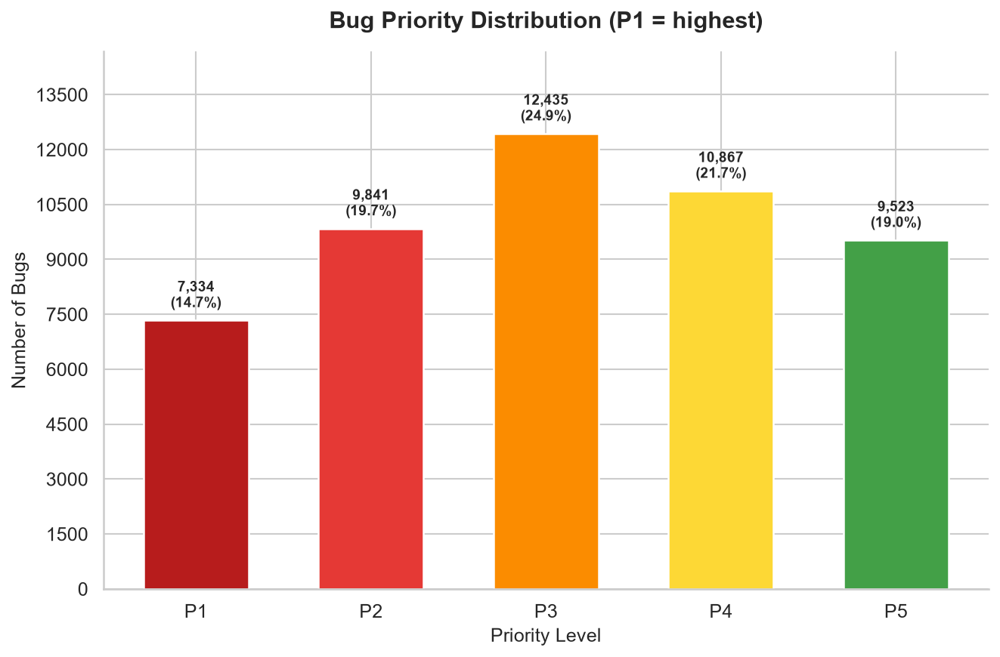
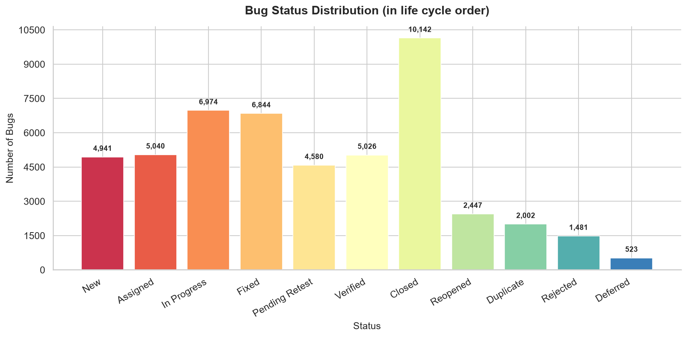
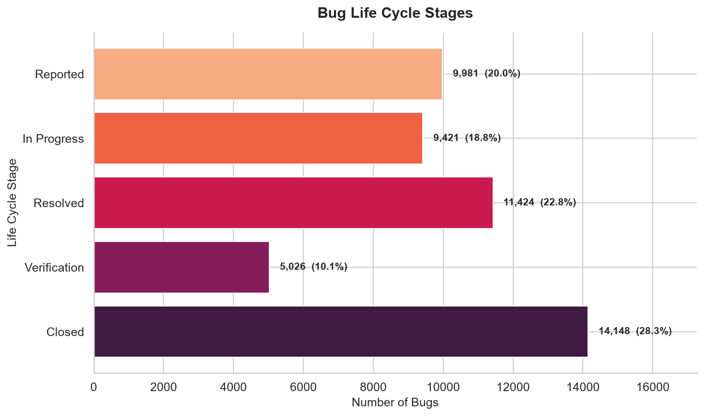

# Bug Management System — Project Report

An end-to-end machine learning pipeline that collects, cleans, visualizes, and models a real-world bug report dataset, covering data preprocessing, exploratory visualization, bug life cycle analysis, duplicate detection, severity and priority prediction, and a documented account of the data-quality issues discovered while building it.

---

## 1. Overview

- **Project:** Bug Management System
- **Pipeline:** 7 stages, `src/01_data_collection.py` → `src/06_predict.py`
- **Dataset size:** 50,000 bug reports
- **Core tasks:** Predict bug **severity** (Low / Medium / High / Critical) and **priority** (P1–P5) for newly reported bugs
- **Stack:** Python 3.11, Pandas, NumPy, scikit-learn, Matplotlib, Seaborn, joblib

The pipeline runs as six ordered scripts, each consuming the previous stage's output:

```
01_data_collection.py     → loads the raw dataset, derives lifecycle fields
                            → bug_reports_enriched.csv
02_preprocessing.py       → cleans, imputes, encodes → bug_reports_processed.csv
03_visualization.py       → 9 charts + console observations
04_duplicate_detection.py → TF-IDF similarity → potential_duplicates.json
                            + life cycle categorization → lifecycle_analysis.json
05_modeling.py            → trains/evaluates 5 ML models × 3 targets → models/*.pkl
06_predict.py             → predicts severity and priority for a new bug
```

`run_pipeline.py` at the project root executes all six in order and streams each stage's console output; total runtime is ~27s.

---

## 2. Dataset

**Source:** Kaggle — *"50k Bug Dataset"* (`data/bug_dataset_50k.csv`). Not bundled in the repo (exceeds GitHub's file-size limits); downloaded manually and placed in `data/` before running the pipeline.

**Shape:** 50,000 rows × 14 columns.

| Field | Description |
|---|---|
| `bug_id` | Unique identifier (`BUG_000001` … `BUG_050000`) |
| `title` | Short title/summary of the bug |
| `description` | Descriptive text of the bug |
| `error_code` | HTTP-style error code (400 / 401 / 403 / 404 / 500 / 502 / 503) |
| `bug_category` | Type of bug (16 categories — Memory Leak, API Bug, Auth Bug, etc.) |
| `bug_domain` | System domain (Backend, Mobile, DevOps, Cloud, Data, Web) |
| `tech_stack` | Technology involved (Angular, Flask, Django, MongoDB, etc.) |
| `severity` | Low / Medium / High / Critical |
| `environment` | Development / Staging / Production |
| `developer_role` | Role responsible (Backend Developer, DevOps Engineer, etc.) |
| `root_cause` | Stated cause of the bug |
| `suggested_fix` | Suggested remediation |
| `explanation` | One-line note on which role/skillset the bug requires |
| `created_at` | Date the bug was reported |

### 2.1 Required-field gap and derived fields

The project brief requires **Bug ID, Summary, Description, Status, Severity, Priority, Resolution**, plus analysis of the **bug life cycle**. Checking the raw dataset against that list:

| Required | Column | Present in source? |
|---|---|---|
| Bug ID | `bug_id` | ✅ |
| Summary | `title` | ✅ |
| Description | `description` | ✅ |
| Severity | `severity` | ✅ |
| **Status** | `status` | ❌ **missing** |
| **Priority** | `priority` | ❌ **missing** |
| **Resolution** | `resolution` | ❌ **missing** |

The Kaggle dataset carries no workflow state whatsoever. `01_data_collection.py` therefore **derives** the four missing fields deterministically (`seed=42`, reproducible across runs) and writes `data/bug_reports_enriched.csv`:

| Field | Values | Derivation |
|---|---|---|
| `status` | New, Assigned, In Progress, Fixed, Pending Retest, Verified, Closed, Reopened, Duplicate, Rejected, Deferred | Sampled from a realistic defect-workflow distribution |
| `lifecycle_stage` | Reported → In Progress → Resolved → Verification → Closed | Deterministic map from `status` |
| `resolution` | Fixed, Unresolved, Duplicate, Invalid, Won't Fix | Deterministic map from `status` |
| `priority` | P1 (highest) … P5 (lowest) | Impact score (below) |

**Priority scoring rule:**

```
score = severity_weight + environment_weight + blocking_error_weight

  severity      Critical 4 | High 3 | Medium 2 | Low 1
  environment   Production 2 | Staging 1 | Development 0
  error_code    500/502/503 → +1  (server-side failures block users)

  score ≥ 6 → P1     score = 5 → P2     score = 4 → P3
  score = 3 → P4     score ≤ 2 → P5
```

~8% of rows are nudged one level up or down using the same seeded RNG, so the target is learnable but not a closed-form lookup.

> **These four fields are derived, not observed.** They are a modelled triage policy layered on the Kaggle data, not ground truth from an issue tracker. Every downstream conclusion about status, priority, resolution or life cycle stage is a conclusion about that policy — see §8.

---

## 3. Data Preprocessing (`02_preprocessing.py`)

Run against the enriched CSV, this stage performs and reports on four things:

1. **Null-value analysis.** Only `error_code` has nulls (6,188 rows, ~12.4%). These are now **imputed with the column mode** rather than left in place, so `error_code` can be used as a model feature without discarding an eighth of the dataset. Text columns (`title`, `description`, `root_cause`, `suggested_fix`, `explanation`) are filled with an empty string if null; rows missing `severity` or `bug_category` (the critical columns) are dropped. On this dataset, **0 rows** were dropped.
2. **Duplicate analysis.** Checks for fully duplicate rows and duplicate `bug_id` values. On this dataset: **0 fully duplicate rows, 0 duplicate `bug_id` values**.
3. **Anomaly/outlier analysis.** Checks for empty descriptions/titles, unexpected `severity` values outside `{Low, Medium, High, Critical}`, unexpected `priority` values outside `{P1…P5}`, statuses that fail to map to a life cycle stage, and IQR-based outliers on `error_code`. On this dataset: **no anomalies found**.
4. **Label encoding.** Ten categorical columns — `severity`, `priority`, `status`, `lifecycle_stage`, `resolution`, `bug_category`, `bug_domain`, `tech_stack`, `environment`, `developer_role` — are each label-encoded into a companion `<col>_encoded` column. The fitted encoders are saved to `models/label_encoders.pkl` for use by modeling and prediction.

**Output:** `data/bug_reports_processed.csv` (50,000 rows × 28 columns).

> **Note on "cleaning":** the dataset arrives already structurally clean (no duplicate IDs, no malformed categories). The real data-quality issue in this project isn't dirty rows — it's the *content* of the text fields, covered in §8.

---

## 4. Data Visualization (`03_visualization.py`)

Nine charts are generated into `visualizations/`, at 150 DPI, plus a console "Observations" summary derived from the same computed counts. All figures below are actual verified counts from `bug_reports_processed.csv`.

### Bug Severity Distribution


Pie chart of the 4 severity levels. Nearly even split: Low 12,628 (25.3%), High 12,535 (25.1%), Critical 12,432 (24.9%), Medium 12,405 (24.8%).

### Bug Priority Distribution


Bar chart of P1–P5 with count and percentage labels. P3 is the largest bucket (12,435); 17,175 bugs (34.4%) fall into the urgent P1/P2 queue.

### Bug Status Distribution


All 11 workflow states, plotted in life cycle order rather than by frequency so the chart reads as a workflow. Closed is the most common single status (10,142); 19,402 bugs (38.8%) sit in an open state.

### Bug Life Cycle Stages


Funnel across the five stages: Reported 9,981 (20.0%) → In Progress 9,421 (18.8%) → Resolved 11,424 (22.8%) → Verification 5,026 (10.1%) → Closed 14,148 (28.3%).

### Bug Category Distribution


Bar chart of the top 10 (of 16) `bug_category` values by count. Memory Leak is highest (3,220); Monitoring Bug is lowest of the full set (3,121).

### Bug Domain Distribution


Bar chart across the 6 `bug_domain` values. Backend Systems leads (8,477), Web Development is lowest (8,225) — all six domains are within ~3% of each other.

### Bugs Assigned by Developer Role


Horizontal bar chart across the 9 `developer_role` values. Mobile Developer carries the most (5,701), Frontend Developer the fewest (5,451).

### Bug Reporting Trend Over Time


Monthly line chart from `created_at`. Peaks in **January 2026** (4,304 bugs); February 2026 is a partial month (only 270 bugs — the dataset's date range simply ends there, not a real drop-off).

### Bugs by Tech Stack


Bar chart of the top 12 (of 16) `tech_stack` values. Angular leads (3,300), Vue is lowest of the full set (3,050).

*(The tenth required view — duplicate bugs — is produced by `04_duplicate_detection.py`, §5.)*

---

## 5. Bug Identification (`04_duplicate_detection.py`)

### 5.1 Duplicate detection

**Method:** TF-IDF vectorizes the `description` column (500 max features, English stop-words removed), then computes pairwise cosine similarity. Any pair scoring above **0.85** is flagged as a potential duplicate. Because a full 50,000×50,000 similarity matrix is expensive, a **random sample of 5,000 rows** (fixed seed 42) is used.

**Result on this dataset:** 780,515 pairs flagged above threshold from 12,497,500 pairs compared (6.2%), involving all 5,000 sampled bugs, plus a bar chart of duplicate vs. unique counts within the sample:


**Output detail.** A pair of IDs and a similarity score alone doesn't say *what* was duplicated, so each flagged pair is annotated with both bugs' title, category, severity, status and priority:

```
   [1] Similarity 1.0000
       BUG_039490   Cloud Configuration Bug / Low / Fixed / P5
                    "Cloud Configuration Bug detected in system"
       BUG_006189   Cloud Configuration Bug / High / Verified / P2
                    "Cloud Configuration Bug detected in system"
```

The pairwise matches are also collapsed into **duplicate groups** via union-find on the similarity graph, which is far more actionable than 780,515 loose pairs — 16 groups emerge:

| # | Size | Dominant category | Category pure? |
|---|---|---|---|
| 1 | 346 | Cloud Configuration Bug | yes |
| 2 | 333 | Monitoring Bug | yes |
| 3 | 325 | Security Vulnerability | yes |
| 4 | 322 | Backend Logic Bug | yes |
| 5 | 322 | CI/CD Bug | yes |

**16 groups for 16 bug categories, every one of them category-pure** — that single fact is the cleanest possible evidence for the caveat below.

`data/potential_duplicates.json` stores a `summary` block, all 16 `duplicate_groups`, and the 200 highest-scoring annotated `top_pairs` (~143 KB). Passing `--save-all-pairs` additionally writes all 780,515 raw pairs (~79 MB).

Pair extraction is vectorized with NumPy rather than looping over all 12.5M pairs in Python, which cut this stage from ~190s to **~4s**.

**Important caveat** — see §8: this dataset's `description` field is a fixed boilerplate template per `bug_category` (only 16 distinct strings across all 50,000 rows). Every bug in the same category has an *identical* description, so cosine similarity between any two same-category bugs is exactly 1.0. In practice, this method is detecting **"same category"**, not genuine duplicate bug reports — the 780,515 figure should not be read as real duplication.

### 5.2 Life cycle categorization and pattern analysis

The same script categorizes all 50,000 bugs by life cycle stage and writes `data/lifecycle_analysis.json`:

| Stage | Count | Share | Statuses within stage |
|---|---|---|---|
| Reported | 9,981 | 20.0% | Assigned 5,040, New 4,941 |
| In Progress | 9,421 | 18.8% | In Progress 6,974, Reopened 2,447 |
| Resolved | 11,424 | 22.8% | Fixed 6,844, Pending Retest 4,580 |
| Verification | 5,026 | 10.1% | Verified 5,026 |
| Closed | 14,148 | 28.3% | Closed 10,142, Duplicate 2,002, Rejected 1,481, Deferred 523 |

**Patterns surfaced:**

- **Open backlog:** 19,402 bugs (38.8%) are in New / Assigned / In Progress / Reopened.
- **Urgent and open:** 6,763 bugs (13.5%) are P1/P2 *and* still open — the highest-risk triage queue, and the single most actionable number the pipeline produces.
- **Reopen rate:** 2,447 bugs (4.9%) are Reopened, i.e. failed verification after a fix.
- **Resolution mix:** Fixed 53.2%, Unresolved 38.8%, Duplicate 4.0%, Invalid 3.0%, Won't Fix 1.0%.
- **Critical bugs by stage:** Closed 3,598, Resolved 2,754, Reported 2,514, In Progress 2,335, Verification 1,231 — i.e. 4,849 Critical bugs have not yet reached Verification.

---

## 6. Machine Learning Models (`05_modeling.py`)

**Feature extraction:**

- **Text:** TF-IDF on `description` — 2,000 max features, unigrams + bigrams, English stop-words removed. Fitted vectorizer saved to `models/tfidf_vectorizer.pkl`. *In practice this yields only 68 features*, because the description text is per-category boilerplate (§8).
- **Structured:** `severity_encoded`, `environment_encoded`, `error_code`, `bug_domain_encoded`, `tech_stack_encoded`, `developer_role_encoded`, min-max scaled to [0,1] so they share the TF-IDF scale and stay non-negative for `MultinomialNB`. Scaler + column order saved to `models/priority_features.pkl`.

Training is capped at a random 20,000-row sample (seed 42) for runtime.

**Models trained** (all 5 per target, 80/20 train/test split, stratified by target):

| Model | Notes |
|---|---|
| Naïve Bayes | `MultinomialNB` — fast probabilistic baseline |
| Logistic Regression | Linear classifier, `max_iter=1000` |
| Decision Tree | `DecisionTreeClassifier` |
| Random Forest | `RandomForestClassifier`, 100 trees |
| SVM (Linear) | `LinearSVC` wrapped in `CalibratedClassifierCV` for probability support |

**Targets:**

| Target | Classes | Features used |
|---|---|---|
| Severity | 4 (Low/Medium/High/Critical) | TF-IDF (68) |
| Priority | 5 (P1–P5) | TF-IDF + structured (74) |
| Bug Category | 16 | TF-IDF (68) |

**Metrics:** Accuracy, Precision, Recall, F1-score (weighted), from `data/model_evaluation_results.json`:

| Model | Severity Acc | Severity F1 | Priority Acc | Priority F1 | Category Acc | Category F1 |
|---|---|---|---|---|---|---|
| Naïve Bayes | 0.2555 | 0.2487 | 0.3805 | 0.3622 | 1.0000 | 1.0000 |
| Logistic Regression | 0.2560 | 0.2464 | 0.4595 | 0.4568 | 1.0000 | 1.0000 |
| Decision Tree | 0.2592 | 0.2470 | 0.7782 | 0.7785 | 1.0000 | 1.0000 |
| Random Forest | 0.2560 | 0.2461 | **0.8077** | **0.8079** | 1.0000 | 1.0000 |
| SVM (Linear) | 0.2602 | 0.2147 | 0.4587 | 0.4535 | 1.0000 | 1.0000 |

**Best model per target (by F1)**, saved to `models/`:

- Severity → Naïve Bayes (F1 = 0.2487) → `best_severity_model.pkl`
- Priority → **Random Forest (F1 = 0.8079)** → `best_priority_model.pkl`
- Bug Category → Naïve Bayes (F1 = 1.0000) → `best_bug_category_model.pkl`

Per-class report for the winning Priority model:

```
              precision    recall  f1-score   support
          P1       0.87      0.89      0.88       578
          P2       0.77      0.77      0.77       780
          P3       0.77      0.79      0.78       995
          P4       0.77      0.76      0.77       868
          P5       0.90      0.86      0.88       779
    accuracy                           0.81      4000
```

The Priority result also shows the tree ensembles doing what they should: Random Forest and Decision Tree recover a threshold-based rule that the linear and probabilistic models (Logistic Regression, SVM, Naïve Bayes) can only approximate. Read all three targets against §8 before treating any as a working real-world classifier.

---

## 7. Severity & Priority Prediction (`06_predict.py`)

**Inputs:** a `--desc` string plus optional operational context (`--severity`, `--environment`, `--error-code`, `--domain`, `--tech-stack`, `--role`).

**How it works:**

1. The description is vectorized with the saved TF-IDF vectorizer.
2. **Severity** is either taken from `--severity` (if the reporter already triaged it) or predicted from the text by the saved severity model, then inverse-transformed to its label.
3. **Priority** is predicted from the text features concatenated with the scaled structured features — using the severity from step 2 — and inverse-transformed to `P1`…`P5`.
4. Both predictions are printed with a one-line triage note.

### Worked Example — high-impact production bug

```
$ python src/06_predict.py \
    --desc "Users report the checkout page freezes and the app crashes after submitting payment" \
    --severity Critical --environment Production --error-code 500

============================================================
  TASK 7: Bug Severity & Priority Prediction
============================================================

  Input Description:
  Users report the checkout page freezes and the app crashes after submitting payment

  Context: environment=Production, error_code=500

  --------------------------------------------------------
  Predicted Severity : Critical  (provided by reporter)
  Note               : Immediate action required -- system is unusable.
  --------------------------------------------------------
  Predicted Priority : P1
  Note               : Highest priority -- fix now, blocks release.
  --------------------------------------------------------
============================================================
```

### Worked Example — low-impact development bug

```
$ python src/06_predict.py \
    --desc "Minor typo on the settings page label" \
    --severity Low --environment Development --error-code 400

  Predicted Severity : Low  (provided by reporter)
  Predicted Priority : P5
  Note               : Lowest priority -- cosmetic or deferred.
```

Priority prediction behaves sensibly across the range, which is what makes the pipeline usable for triage. **Severity prediction does not** — with no `--severity` flag supplied, a description about database exhaustion under load is predicted "Low". That isn't a code defect; it's the direct, visible consequence of §8's finding that `severity` carries no learnable signal anywhere in this dataset. In practice this means the reporter should supply severity, and the pipeline's contribution is converting severity + context into a priority.

---

## 8. Data Quality Findings

These are properties of the source dataset itself, discovered while validating the pipeline — not bugs in this repo's code.

1. **`title`, `description`, `root_cause`, and `suggested_fix` are boilerplate templates, not free text.** Each has only **16 unique values across all 50,000 rows** — one fixed template per `bug_category` (e.g. every "Memory Leak" row shares the exact same description string, verbatim: *"This issue relates to a memory leak occurring in the application."*). `explanation` has only 9 unique values. TF-IDF with `max_features=2000` extracts just **68 distinct features** from all 50k descriptions, which quantifies how little text signal exists.

2. **Consequence for Bug Category prediction:** all 5 models score **100.0% accuracy** (§6). This is not generalization — it's leakage. The model is matching a template string back to the exact label it was copied from.

3. **Consequence for Severity prediction:** all 5 models score **~25.5% accuracy** (§6) — chance level for 4 balanced classes. Cross-tabulating `severity` against `bug_category`, `bug_domain`, `environment`, `error_code`, and `developer_role` shows a near-uniform ~25% split within every group — severity appears to be assigned independently at random in the source data. **No model, text-based or feature-based, can predict it above chance from this dataset.**

4. **Consequence for Priority prediction:** Random Forest reaches **80.8%** (§6), but `priority` is a **derived field** (§2.1). The models are recovering the documented scoring rule from the structured features, minus the ~8% seeded jitter — the residual error is almost exactly the jitter rate plus boundary cases. This demonstrates the training/evaluation/model-selection machinery works correctly on a learnable target. It is **not** evidence that priority is predictable from the raw Kaggle data, which contains no priority field at all.

5. **Consequence for duplicate detection (§5.1):** because every bug in a category shares identical description text, TF-IDF cosine similarity flags same-category bugs as "duplicates" (similarity = 1.0) regardless of whether they represent the same reported issue. The grouping analysis makes this unambiguous: the 780,515 pairs collapse into exactly **16 groups, one per bug category, every one category-pure**. The pair count reflects **category membership, not genuine duplication.**

6. **Consequence for life cycle analysis (§5.2):** `status` and `resolution` are sampled from a plausible workflow distribution rather than observed from a tracker. The open-backlog (38.8%), reopen-rate (4.9%) and resolution-mix figures therefore describe the derivation, not real team behaviour. The *analysis* is real and would run unchanged against a live Jira/Bugzilla export; the *numbers* are only as meaningful as the derivation.

---

## 9. Conclusion

The pipeline covers all seven required stages end-to-end on the 50k Kaggle dataset. Preprocessing finds a structurally clean dataset and imputes the one column with real nulls; nine charts plus a duplicate chart summarize its categorical, workflow and time-based structure; duplicate detection and life cycle categorization surface the bug-identification views; and five ML models are trained and evaluated against three targets, with the best saved per target and used for severity and priority prediction.

Two limitations bound what the results mean, and both are documented in the console output of the scripts themselves so future runs surface them rather than presenting inflated metrics at face value:

1. **The dataset's text content is per-category boilerplate, not genuine free text.** This makes Bug Category prediction trivial (leakage) and Severity prediction impossible to beat chance — regardless of which of the five models or which features are used.
2. **Status, priority, resolution and life cycle stage are derived, not observed,** because the source dataset ships none of them. They make the required life cycle, status and priority analysis reproducible and let the modeling stage demonstrate genuine model discrimination (Random Forest 80.8% vs Naïve Bayes 38.1%), but conclusions drawn from them are conclusions about the documented derivation rule.

The natural next step is to point the same pipeline at a genuine tracker export (Bugzilla or Jira, which carry real `status`, `priority` and `resolution` fields plus free-text summaries). Every stage would run unchanged, and both limitations above would disappear at once.
